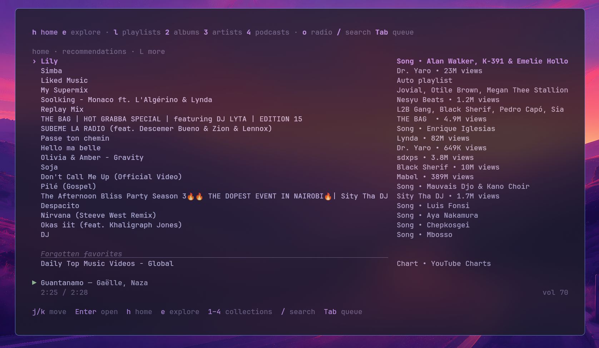
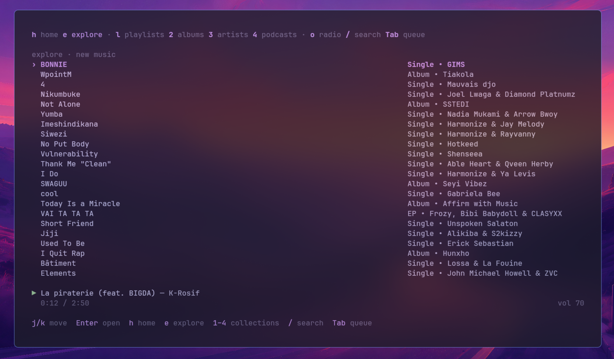
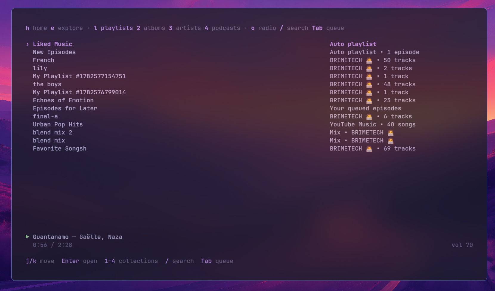
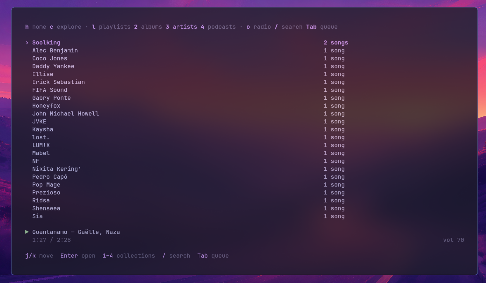
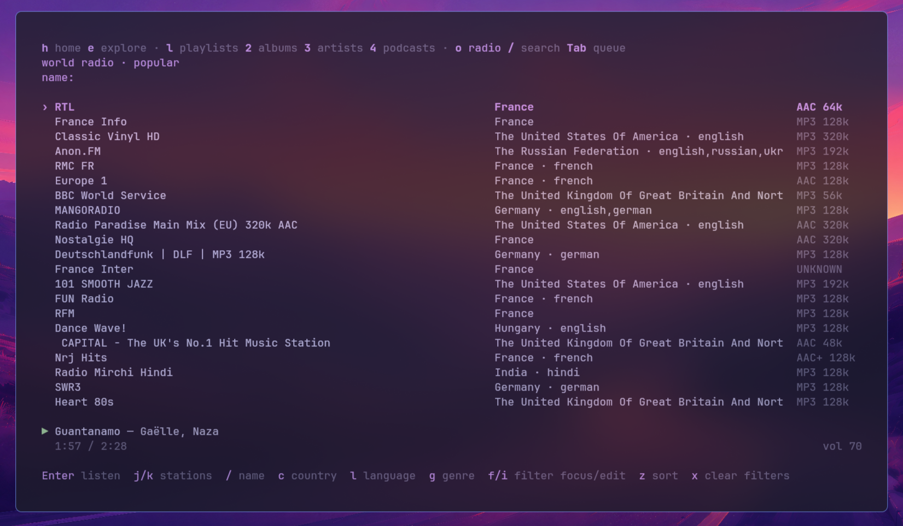
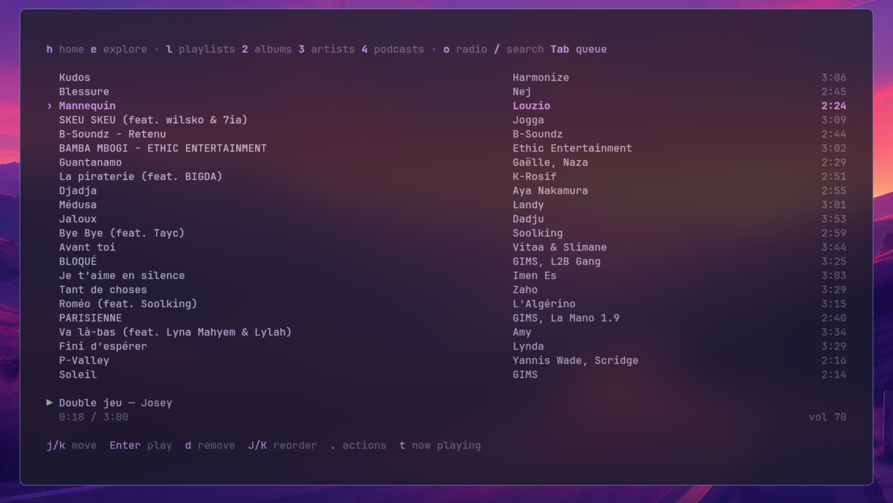
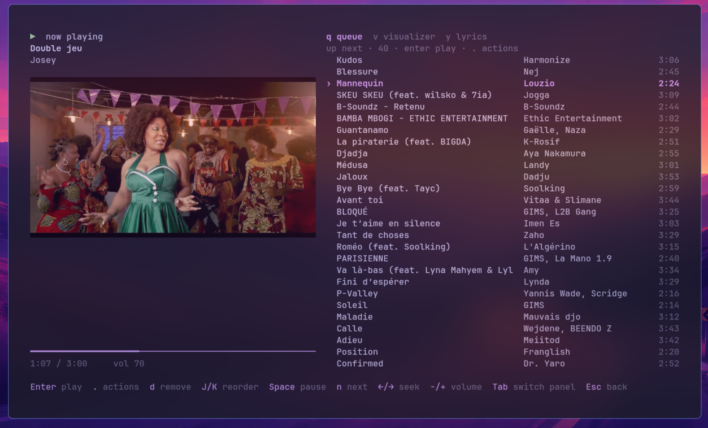
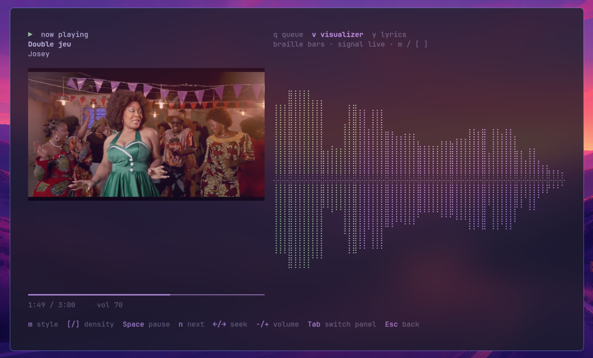

# Dymus

[](LICENSE)

Dymus is a keyboard-driven YouTube Music streaming TUI for Linux. It searches
YouTube Music through InnerTube, resolves streams with yt-dlp, and controls mpv
for audio playback. It uses the terminal's own background and defaults to the
Tokyo Night palette.

## Screenshots

<table>
  <tr>
    <td width="50%" valign="top"><br><sub><b>Home</b> — signed-in recommendations and shelves</sub></td>
    <td width="50%" valign="top"><br><sub><b>Explore</b> — browseable collections; Enter opens a shelf</sub></td>
  </tr>
  <tr>
    <td width="50%" valign="top"><br><sub><b>Playlists</b> — your signed-in library</sub></td>
    <td width="50%" valign="top"><br><sub><b>Artists and Albums</b> — signed-in library views</sub></td>
  </tr>
  <tr>
    <td width="50%" valign="top"><br><sub><b>World Radio</b> — Radio Browser stations with filters</sub></td>
    <td width="50%" valign="top"><br><sub><b>Queue</b> — upcoming playback, reordered with J / K</sub></td>
  </tr>
  <tr>
    <td width="50%" valign="top"><br><sub><b>Now Playing</b> — cover art, progress, and queue</sub></td>
    <td width="50%" valign="top"><br><sub><b>Visualizer</b> — nine styles, audio-reactive through PipeWire</sub></td>
  </tr>
</table>

## Features

- Home and Explore feeds, public search, and a separate playback queue.
- Signed-in Playlists, Albums, Artists, and Podcasts views.
- Bulk playback and queue operations for marked songs.
- Generated YouTube Music radio from any focused song.
- World Radio via Radio Browser, with station, country, language, genre, and
  sorting filters.
- Playback progress, seeking, volume, cover art, and automatic queue advancement.
- MPRIS media integration so desktop shells and media keys can show the current
  track and control playback.
- A Now Playing view with queue, lyrics, and nine visualizer styles.
- Plain and synced lyrics from LRCLIB.
- Theme presets, color overrides, configurable startup view, and keybindings.

## Install and run

Dymus targets 64-bit Linux and needs `mpv` and `yt-dlp` on `PATH`. Downloads
also require `ffmpeg` (including `ffprobe`). Public
search and World Radio do not require an account. Playback availability depends
on the track and region.

PipeWire's `pw-dump` and `pw-record` enable audio-reactive visualizers.
Music playback works without them, using animated fallback visuals.

```sh
curl -fsSL https://raw.githubusercontent.com/britonmearsty/dymus/master/install.sh | sh
```

The installer verifies the release checksum and installs `dymus` to
`~/.local/bin` (or `BIN_DIR` if set). Restart your shell or add that directory
to `PATH`, then run:

```sh
dymus doctor
dymus
```

To install a specific release, set its tag first:

```sh
curl -fsSL https://raw.githubusercontent.com/britonmearsty/dymus/master/install.sh | DYMUS_VERSION=v0.3.0 sh
```

Or install from [crates.io](https://crates.io/crates/dymus) with Cargo 1.88 or newer:

```sh
cargo install dymus
```

For a development build, install Rust 1.88 or newer and use:

```sh
git clone https://github.com/britonmearsty/dymus.git
cd dymus
cargo run -- doctor
cargo run
```

For an optimized build:

```sh
cargo build --release
./target/release/dymus
```

`dymus doctor` checks the external playback, optional download, and PipeWire tools. Normal startup
does not wait for those checks. Image-protocol detection uses a short probe and
falls back to halfblocks when the terminal does not respond.

Search full YouTube without opening the TUI, choose a numbered result, then
choose audio-only or video playback:

```sh
cargo run -- search "Nujabes Feather"
cargo run -- search "Rust tutorial" --limit 15 --detach
# Return JSON without prompting or starting playback:
cargo run -- search "Nujabes Feather" --json
```

## Manual page

Dymus bundles an offline manual covering commands, options, TUI keys,
configuration, local media, downloads, and integrations. After a Cargo install:

```sh
dymus man --install
man dymus
```

The page installs to `$XDG_DATA_HOME/man/man1/dymus.1`, defaulting to
`~/.local/share/man/man1/dymus.1`. If your `man` search path does not include
that directory, use `man -l ~/.local/share/man/man1/dymus.1` or add the man root
with `export MANPATH="$HOME/.local/share/man:"`; the trailing colon preserves
system manual paths. `dymus man` prints roff for packaging or `man -l` previews.
`dymus man --install --directory /path/to/man` selects a different man root.

Release archives include `dymus.1`; the shell installer installs it automatically
when present. Set `MAN_DIR` to override its man root. Older binary-only releases
remain installable. Cargo installs binaries only, so run `dymus man --install`
after installing or upgrading with Cargo to refresh the manual.

To validate a changed manual locally (requires groff):

```sh
cargo test manual_documents_all_public_long_options
cargo build
sh scripts/check-manpage.sh ./target/debug/dymus
```

CI checks public long-option coverage and renders the bundled manual, rejecting
roff diagnostics before changes can pass validation.

## Headless playback

Headless search uses full YouTube through yt-dlp, including music, interviews,
tutorials, and other videos. `dymus search "query"` shows ten results by default;
choose a result, then choose audio-only or video playback. `--detach` and
`--volume` apply to either mode. Video playback defaults to a 1080p cap, configurable with `video_height`.

Headless playback uses a compact inline card: title, artist, a slim progress bar,
and a muted status line with mode, queue position, and volume. Loading and
selection update in place rather than accumulating a step log. The layout adapts
to terminal width and uses a single-line fallback in very short terminals.
`NO_COLOR` disables color; piped output stays plain text.

Enter a result number to select it; use `n` and `p` followed by Enter to change
pages. `q`, Esc, or Ctrl+C cancels a prompt; Ctrl+C cancels loading or stops
attached playback. Detached playback prints a compact confirmation and returns
to the shell. Use `dymus control` for transport controls.

Set `headless_search_results` in `~/.config/dymus/config.toml` to show between
1 and 50 matches, or override it for one search with `--limit`:

```toml
headless_search_results = 15 # full YouTube search; default 10, range 1–50
video_height = 1080          # maximum video height; default 1080, range 144–4320
headless_results = 5         # YouTube Music collections; default 5, range 1–25
```

`dymus play song "query"` and `dymus play song "query" --video` also search full
YouTube and let you pick a result, using the same search cap. Audio is the
default; pass `--video` to play video instead. Album, playlist, and signed-in library
commands continue to use YouTube Music and the separate `headless_results` cap.

`video_height` is a maximum, so a source with lower resolution plays at its best
available height. Set it to `720`, `1080`, `1440`, or `2160`, for example.
The chosen cap is saved with the playback queue so detached and later tracks
use the same height even if the config changes. Both settings are top-level
TOML keys, before sections such as `[colors]` and `[keybindings]`.

To add authenticated tracks to YouTube Music history after they have genuinely
played, opt in explicitly (it is off by default):

```toml
report_history = true
report_history_after_seconds = 30
```

The threshold accepts 1 through 3600 seconds. Reporting failures never stop
playback.

## Last.fm scrobbling

Create a Last.fm API application, then run `dymus lastfm login` and approve the
printed authorization URL. Alternatively, `dymus lastfm paste` accepts an
existing API key, shared secret, and session key privately. Dymus verifies the
session before saving it. Every eligible non-radio track updates Last.fm Now Playing
when playback loads and is scrobbled after the service's rule: more than 30
seconds long and played for half its duration or four minutes, whichever comes
first. Both TUI and headless playback use the same credentials. Scrobbling
counts actual listening time, excluding pauses and seeks, and
reports each repeat separately. Requests run in the background.
This is enabled by default whenever credentials exist; set
`lastfm_scrobbling = false` in the configuration to disable it. Use
`dymus lastfm status` to recheck the connection or `dymus lastfm logout` to
remove only those credentials.

```sh
dymus play song "Nujabes Feather"
dymus play song "Gorillaz Feel Good Inc" --video
dymus play album "Modal Soul" --video
dymus play playlist "Lo-fi beats" --detach --volume 65
dymus play library playlists --detach
```

`dymus play song "query" --video` searches full YouTube and opens the chosen
result in an mpv window without starting the TUI. It supports `--detach` and
`--volume`, and uses the same `dymus control` commands as audio playback.
A graphical session is required. Video playback selects the best available
video up to the configured `video_height`
and the best audio stream separately, letting mpv synchronize them during
streaming. If separate streams are unavailable, it falls back to a combined
audio/video stream with the same height cap. `--video` works with song, album, playlist,
and signed-in library playback and applies to every queued track, including
when detached. Without the flag these commands play audio only. Tracks without
an available video stream cannot play in video mode.

`dymus search "query" --video` skips the audio/video mode prompt after choosing
a result. Without that flag, search still lets you choose the playback mode.

Without `--detach`, the command stays attached until mpv exits. Detached
playback remains available after the shell command ends and can be controlled
from any terminal in the same user session:

```sh
dymus control status
dymus control toggle
dymus control next
dymus control volume 50
dymus control stop
```

Attached playback keeps one terminal line updated with the active track,
play/pause state, and elapsed time. Use `--detach` when that display is not
needed.

Headless audio and video playback expose MPRIS as `org.mpris.MediaPlayer2.dymus.headless`
(`Dymus (headless)`), including when detached. Desktop media keys and players
can control playback, volume, seeking, repeat, shuffle, and the queue, with
current track metadata and cover art. The TUI keeps its separate MPRIS identity.
One event-driven worker handles desktop controls, Last.fm, optional YouTube
Music history reporting, and background queue resolution. Integration failures
are logged in `$XDG_RUNTIME_DIR/dymus/headless.log` (under the config directory
when no runtime directory exists) and do not stop playback.

The control socket is local to your user session and only one headless Dymus
player can run at a time. Headless album and playlist playback may need YouTube
Music credentials; configure them with `dymus auth paste` when required.
Only the first selected track is resolved before playback starts. Remaining
album or playlist tracks are resolved and added to mpv in the background.

## Headless downloads

Download audio, videos, complete playlists, or albums without opening the TUI:

```sh
dymus download song "Nujabes Feather"
dymus download video "Gorillaz Feel Good Inc"
dymus download album "Modal Soul"
dymus download playlist "Lo-fi beats" --video
dymus download song "https://www.youtube.com/watch?v=VIDEO_ID"
dymus download playlist "https://www.youtube.com/playlist?list=PLAYLIST_ID" --path "~/Music/Mixes"
```

Queries use the existing interactive result picker. Direct URLs run without
prompts, including in scripts. Songs and videos ignore any playlist attached to
their URL; album and playlist URLs download the complete collection. Query-based
collections load every available page. `--video` applies to every track in any
download command. Downloads require `yt-dlp`, `ffmpeg`, and `ffprobe`, and reuse
configured YouTube Music cookies when available.

Progress shows percentage, downloaded size, speed, and ETA, followed by merging,
conversion, or metadata processing. Ctrl+C stops the downloader and its ffmpeg
children. Completed files remain on disk and partial transfers resume when you
rerun the command. Failed items are reported; collections continue by default,
and any failure makes the command exit unsuccessfully. Existing files are
protected from overwrites. Archive-based skipping is opt-in:
`skip_downloaded = true` skips a source across collections within the same
destination, so shared tracks may be absent from a newly requested collection.
The default keeps each collection self-contained. Downloading does not change
playback or submit scrobbles.

Configure downloads in `~/.config/dymus/config.toml`:

```toml
[downloads]
audio_path = "~/Music/Dymus"
video_path = "~/Videos/Dymus"
filename = "%(title)s [%(id)s].%(ext)s" # relative yt-dlp template; %(ext)s required
audio_format = "best" # best, aac, alac, flac, m4a, mp3, opus, vorbis, wav
audio_quality = "0" # 0–10 (best to worst), or a bitrate such as "320K"
video_format = "mp4" # mp4, mkv, webm
# video_height = 1080 # omitted: use the top-level video_height setting
organize_by_type = true
write_manifest = true
write_playlist = true
write_thumbnail = true
playlist_subdirectories = true
number_tracks = true
embed_metadata = true
embed_thumbnail = false
resume = true
overwrite = false
skip_downloaded = false
continue_on_error = true
progress = true
retries = 10
fragment_retries = 10
concurrent_fragments = 4 # 1–32
socket_timeout = 30 # seconds
# rate_limit = "2M" # optional per-transfer bandwidth cap, e.g. "500K" or "2M"
```

Every setting has a built-in default; no `[downloads]` section is required.
The default layout under either the audio or video destination is:

```text
Dymus/
├── Singles/<Artist or uploader>/<Title> [video-id].ext
├── Albums/<Album title> [collection-id]/001 - <Title> [video-id].ext
├── Playlists/<Playlist title> [collection-id]/001 - <Title> [video-id].ext
├── library.json
└── .dymus/playlists/<stable-collection-id>.m3u8
```

Collection folders use the selected collection's title and source ID rather than
the search query. Numbers preserve playlist order and repeated songs. Thumbnails
are saved alongside media files for offline artwork, and embedded metadata is
enabled. Unavailable metadata falls back to the selected search result or
`Unknown Artist`.

`library.json` uses schema version 1 and records each collection's type, source
ID, audio/video mode, ordered track metadata, duration, source URL, local media
and thumbnail paths, and M3U8 location. Paths are relative to the download root;
moving the whole folder preserves both the index and playlists. Files are added
only after a completed download; metadata is updated atomically as each file
finishes, so cancellation or failures retain a usable partial collection marked
`partial = true`. Successful reruns reconcile collection membership when archive
skipping is disabled; archive mode preserves previously indexed entries. Singles
accumulate across downloads. The index contains curated media fields and excludes
cookies and authentication data.

UTF-8 M3U8 playlists include durations and titles, reference completed media with
relative paths, and can already be opened by mpv or another local player. These
files also preserve collection order when played locally in Dymus. Set
`organize_by_type`, `write_manifest`, `write_playlist`, or `write_thumbnail` to
`false` to opt out of those defaults. Existing files outside this layout are not
moved automatically.

Paths expand a leading `~`; relative paths resolve from the current directory.
`--path` overrides the destination for one command. Audio defaults to the best
available source format without unnecessary lossy conversion; selecting MP3 or
another format enables ffmpeg conversion. Video selects the best video and audio
within the height cap, then merges/remuxes to the configured container. Overwrite
mode bypasses the archive and replaces existing files. Disabling progress hides
transfer updates while retaining saved-file messages and errors. New config
settings take effect on the next download command.

## Video in the TUI

Press `V` to switch the current track between audio and video. Video opens in a
compact, resizable mpv window (640×360 maximum initial size), with always-on-top
disabled, while the TUI remains available for browsing and playback controls.
Switching keeps the playback position and pause state; resolving a different
stream briefly reloads playback. The selected mode applies to subsequent tracks,
including preloaded queue entries. Radio remains audio-only.

Streaming video uses `video_height` (1080 by default) and retains the separate
high-quality audio stream. Configure the shortcut with `video = "V"` under
`[keybindings]`. Local video retains its existing automatic playback default;
using `V` explicitly selects video or audio for the session.

## Local library playback

Downloaded media is immediately available offline in both interfaces. Local
playback requires only mpv; yt-dlp and YouTube sign-in are unnecessary. The
reader loads `library.json`, keeps collection order and repeated tracks, skips
missing files, and shows missing counts and partial collections. Additional
folders can be imported; filenames, embedded tags, duration, and nearby artwork
are read locally. Tag results are cached by file modification time and size.
Folder scans ignore symlink directories and hidden management folders.

```sh
dymus local                  # list local collections and tracks
dymus local "Artist" --json  # filter and return stable collection IDs
dymus play local             # choose a collection, then all tracks or one track
dymus play local "Album" --all --detach
dymus play local --id LOCAL_COLLECTION_ID --detach
dymus play local "/path/to/song.flac"
dymus play local "/path/to/video.mp4" --video
dymus play local "/path/to/mix.m3u8" --detach
dymus play local --path "/path/to/music" --all
```

`--all` queues every track in matching collections without prompts. `--id`
selects an entire collection without prompting. Direct files and M3U paths also
play without prompts; an unambiguous match can run from a script. Listing and
playing accept `--path` to read a specific file, folder, or UTF-8 M3U/M3U8 playlist.
M3U entries can use relative paths or `file://` URLs; network entries are skipped.
Headless playback supports attached progress, `--detach`, `--volume`, `--video`,
`dymus control`, and MPRIS as usual. MPRIS uses local file and artwork URLs.
Local plays can scrobble to Last.fm when enabled; they never submit YouTube
history or invoke YouTube extraction. Browsing, covers, and local lyric sidecars
work without network access.

In the TUI, press `5` to browse local collections, Enter to open one, `/` to filter
by collection, title, artist, or album, and `L` to refresh after downloading or
restoring files. Use Enter to play a track, `P` to play all, `a`/`A` to queue or
play next, `Q` to queue all, and the normal mark, reorder, repeat, shuffle, seek,
and transport controls. Local and streamed tracks can share a queue. Local
videos open an mpv window; audio files remain audio-only. Covers use adjacent
thumbnail files or `cover.jpg`/`folder.jpg`; `.lrc` and `.txt` sidecars provide
synced or plain lyrics. Set `start_view = "local"` to open the TUI directly into
an offline library view.

Built-in defaults include the configured audio and video download destinations:

```toml
[local]
roots = [] # additional folders, e.g. ["~/Music", "/media/drive/Music"]
include_downloads = true
scan_unindexed = true
recursive = true
read_tags = true # ffprobe is optional; otherwise use filenames and folder names
video = true # TUI video windows; headless video is selected with --video

[keybindings]
local = "5"
```

The index is preferred over scanning for downloaded tracks. Scanning imports
unindexed files as folder collections with natural filename ordering. Disable
`scan_unindexed` for an index-only library. Metadata work runs in the background
and can be cancelled; refresh picks up new files without restarting playback.

## How it works

Home, Explore, search, library, and generated radio requests use YouTube Music's
unofficial InnerTube endpoints. A successful Home or Explore feed is stored in
`$XDG_CACHE_HOME/dymus` (usually `~/.cache/dymus`). On the next launch, Dymus
shows that cached feed immediately, refreshes it in the background, and replaces
it when the fresh response arrives.

When playback starts, yt-dlp resolves the selected YouTube URL to an audio
stream. Dymus passes that stream to mpv and monitors mpv through its JSON IPC
socket for progress, pause state, failures, and end-of-track events. Each
attempt receives a generation ID, so late events from a cancelled attempt cannot
change the active queue. Helper processes stop when playback is cancelled or the
application exits.

Cover images use the best terminal image protocol detected at launch. Lyrics are
looked up from LRCLIB using the active track metadata. The visualizer attempts
to isolate Dymus's mpv stream through PipeWire and analyze its audio frames; if
capture is unavailable, it uses its fallback animation.

## Views

Home and Explore contain browseable YouTube Music collections. Press Enter on a
collection to open its tracks and Esc to return. Rows retain their source shelf,
so recommendations, mixes, and quick picks remain visibly separated in the
minimal table. Press `L` on a row to load the next page for that shelf when
YouTube Music provides one. Search contains public tracks; the queue contains
upcoming playback. Playlists, Albums, Artists, and Podcasts are separate
top-level signed-in views.

Now Playing presents the active track, cover art, and a minimal progress bar. Its
right panel switches between queue, visualizer, and lyrics. Synced lyrics
distinguish elapsed, current, and upcoming lines; plain lyrics can be scrolled.

## Authentication

Signing in enables library and account endpoints. Public search, generated
radio, and World Radio work without an account.

1. Sign in to YouTube Music in a browser. In Developer Tools → Network, copy
   the **Cookie request header value** from a successful `browse` request,
   without the `Cookie:` label.
2. Paste it into Dymus's hidden-input prompt:

   ```sh
   cargo run -- auth paste
   ```

   To use another Google account in that browser session, provide its
   `X-Goog-AuthUser` index: `cargo run -- auth paste --auth-user 1`.
3. Dymus signs and validates an account request before saving credentials. Use
   `dymus auth status` to check the saved session and `dymus auth logout` to
   remove it.

You can import cookies directly from a browser supported by yt-dlp:

```sh
dymus auth browser
dymus auth browser --browser chrome
```

Supported browsers are Brave, Chrome, Chromium, Edge, Firefox, Opera, Safari,
Vivaldi, and Whale (subject to the installed yt-dlp version). Use `--profile`
to select a profile by name or path. Firefox also accepts `--container` for a
Multi-Account Container. Chromium-based browsers on Linux can use `--keyring`
to select the cookie decryption keyring (`basictext`, `gnomekeyring`, `kwallet`,
`kwallet5`, or `kwallet6`). The importer keeps only secure YouTube Music cookies
in a private temporary file, validates the account, and removes that file. If
the browser profile is locked or cannot be read, close the browser and retry.
`dymus auth paste` remains available.

Credentials live in `$XDG_CONFIG_HOME/dymus/auth.json` (normally
`~/.config/dymus/auth.json`). Dymus creates the directory with `0700` and the
file with `0600`. For authenticated stream resolution it creates a private,
short-lived yt-dlp cookie jar and removes it as soon as the resolver exits; it
does not log cookie values. The file is protected by filesystem permissions
but is not encrypted. Browser profiles are read only when explicitly requested
with `dymus auth browser`.

Browser cookies are bearer credentials. Do not put them in issues, chat, shell
history, or source files. If exposed, revoke that Google session and use a fresh
cookie.

## Configuration

On first launch Dymus creates `$XDG_CONFIG_HOME/dymus/config.toml` (normally
`~/.config/dymus/config.toml`). Press `s` to open Settings: Up/Down selects a
theme or startup view, Left/Right changes it, and the selection is saved
immediately. The default startup view is Home.

Built-in themes are Tokyo Night, Catppuccin Mocha, Gruvbox Dark, and Nord. The
terminal background stays untouched for transparency. The TOML file accepts
six-digit color overrides and custom keys. Key values accept one character or
names such as `Tab`, `Space`, `Enter`, `Esc`, `Left`, and `Ctrl+U`.

```toml
theme = "nord"
video_height = 1080
headless_search_results = 15
start_view = "home" # home, explore, playlists, albums, artists, podcasts, radio, local, search, queue

[colors]
accent = "#88c0d0"
text = "#eceff4"

[keybindings]
settings = ";"
search = "/"
playlists = "1"
albums = "2"
artists = "3"
podcasts = "4"
radio = "o"
next_track = "n"
```

Restart after manually editing keys or colors. Settings changes made in the app
are applied and saved immediately.

## Controls

The footer shows actions available in the current view. `/` focuses Search;
type a query and press Enter. While editing, ordinary keys enter text and Esc
returns to browsing.

| Key | Action |
| --- | --- |
| `h` / `e` | Home / Explore |
| `1` / `2` / `3` / `4` | Playlists / Albums / Artists / Podcasts |
| `o` | World Radio |
| `5` | Local library |
| `/` | Search or edit the World Radio station filter |
| Tab | Switch Search and queue, or cycle Now Playing panels |
| `t` | Now Playing |
| `s` / `?` / `q` | Settings / help / quit |
| `j` / `k`, arrows | Move selection |
| `g` / `G`, Home / End | First / last row |
| Enter | Search, open a collection, or play the focused/marked song |
| Esc | Return from a collection, clear marks, or dismiss an error |
| `x` / `v` | Mark focused song / select or deselect all |
| `.` | Open contextual actions |
| `a` / `A` | Append to queue / put next |
| `P` / `Q` | Play all / queue all loaded songs |
| `R` | Start generated radio from focused song |
| `f` | Cycle search results: songs, artists, albums, playlists |
| `L` | Load more results from Search, a focused Home or Explore shelf, or Library |
| `d`, Delete | Remove focused or marked queue entries |
| `J` / `K` | Move focused or marked queue entries down / up |
| `C` | Clear upcoming tracks without stopping the current track |
| Space / `n` / `r` | Pause or resume / skip / restart or retry |
| Left / Right | Seek backward or forward five seconds |
| `-` / `+` | Lower or raise volume |
| Ctrl+C / Ctrl+U | Quit from any mode / clear search while editing |

Bulk actions use marked songs when marks exist; otherwise they use the focused
row. `P` replaces the upcoming queue with the loaded list, while `Q` appends
it. Enter starts the first chosen song and puts the remaining songs next while
preserving order. Queue marks follow their entries when moved or advanced.

Inside Now Playing, `q`, `v`, and `y` choose the queue, visualizer, and
lyrics panels. Tab and Shift+Tab cycle between those panels. In the visualizer,
`m` or `]` selects the next style and `[` selects the previous style. In
the lyrics panel, `p` switches between plain and synced lyrics when both are
available, and `j`/`k` scroll plain lyrics.

## Generated radio and World Radio

`R` builds a YouTube Music mix from the focused song. It starts with that song,
then queues related tracks returned by InnerTube while skipping duplicates and
unavailable entries. Existing playback and the queue remain intact if loading
fails. Esc, another radio request, or a manual playback/queue change cancels a
pending request.

World Radio uses Radio Browser's public directory and plays station URLs
directly through mpv. The initial list contains popular working stations. Use
`/`, `c`, `l`, and `g` to filter by station name, country, language, and
genre. `f` selects a filter, `i` edits it, `z` cycles popularity, trending,
votes, bitrate, and alphabetical sort, and `x` clears filters. Enter plays the
selected station.

## Limits and troubleshooting

Search can load additional pages with `L`; use `f` to choose songs, artists,
albums, or playlists, then Enter to open a collection. Generated radio loads
one mix and does not continue endlessly. Use headless `--detach` for background
playback; MPRIS works in both modes. TUI queue and search state stay in memory;
exiting the TUI stops its playback, though
the upcoming queue is saved and restored on the next launch.
Account-restricted tracks are not supported.

InnerTube is unofficial and may change. Stream extraction relies on a current
yt-dlp installation. Dymus deliberately ignores user yt-dlp and mpv configuration
so unrelated player options cannot alter its behavior. If playback fails, run
`dymus doctor`, update yt-dlp through your package manager, and try another
track. Dymus targets Linux and uses Unix sockets for mpv IPC.

## Contributing

Bugs, feature ideas, and pull requests are welcome — see
[CONTRIBUTING.md](CONTRIBUTING.md) for how to report issues and open PRs.

## Development

```sh
cargo fmt --check
cargo clippy --all-targets -- -D warnings
cargo test
# Optional mpv integration test: generated silence and null audio output.
cargo test mpv_reports_playback_and_eof_with_local_audio -- --ignored
# Optional live search → stream test: public query, null audio output, network required.
cargo test live_search_resolve_and_stream_audio -- --ignored --nocapture
# Optional generated-radio request check.
cargo test live_radio_returns_related_tracks -- --ignored --nocapture
```

Source layout:

- `innertube.rs`: YouTube Music HTTP client and response parsing.
- `model.rs`: track and queue data.
- `player.rs`: stream extraction, mpv lifecycle, and JSON IPC.
- `visualizer.rs`: PipeWire discovery and audio analysis.
- `lyrics.rs`: LRCLIB lookup and synced-lyric parsing.
- `radio.rs`: Radio Browser client and station filtering.
- `cache.rs`: local Home and Explore cache.
- `config.rs`: TOML preferences, palettes, and keybindings.
- `app.rs`: application state, actions, and asynchronous jobs.
- `ui.rs`: terminal layout and rendering.

## Inspiration

- [ytermusic](https://github.com/ccgauche/ytermusic): simplicity and playlist workflow.
- [youtui](https://github.com/nick42d/youtui): music discovery and keyboard navigation.
- [ytmusic-tui](https://github.com/WakaTaira/ytmusic-tui): browsing and queue interaction.
- [ytmusicapi](https://github.com/sigma67/ytmusicapi): InnerTube request and response reference.

Dymus is not affiliated with or endorsed by YouTube or Google.
